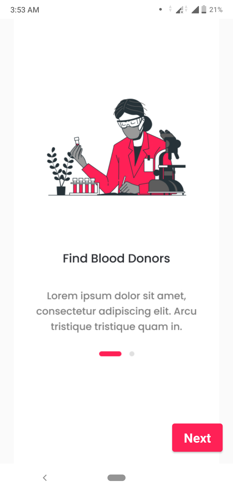
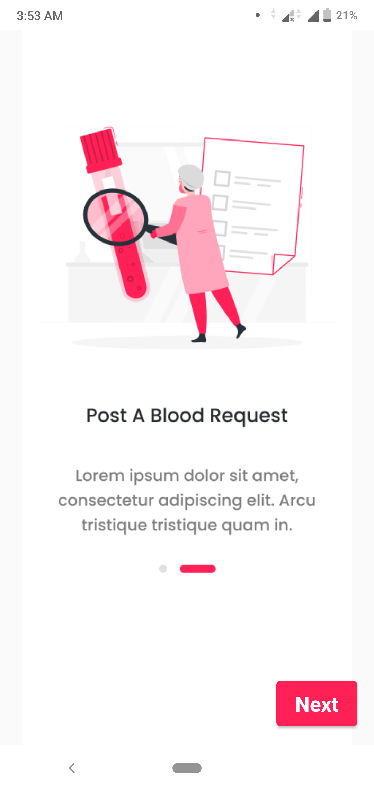
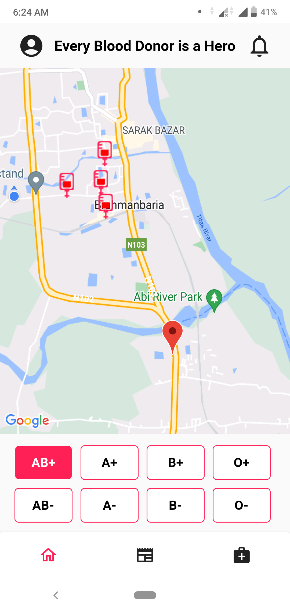
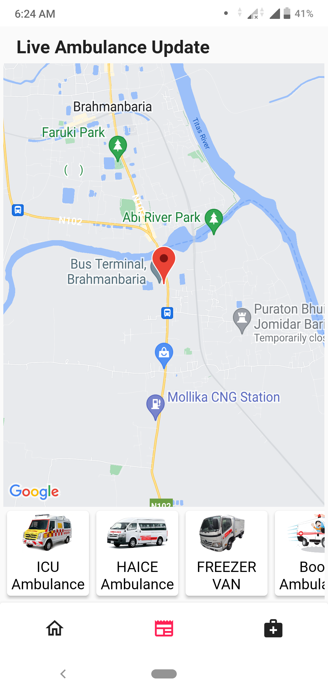
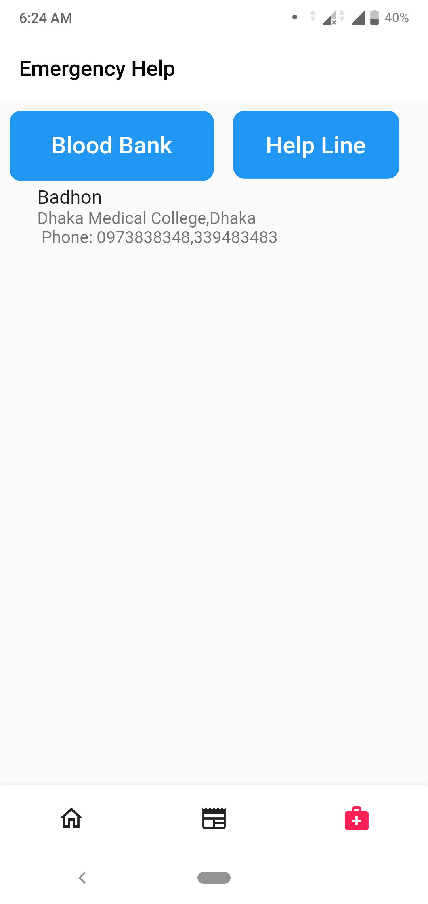

# DonerCall 
<a href="https://drive.google.com/file/d/1NhzeS7e2UEb3gZN4-WJR7eLL6b1fliN-/view?usp=sharing" target="_blank">APK DOWNLOAD</a>

    

## Functionaly

1. Donors/Users can create an account
2. Find a notification when ready to donate blood.
3. User-only sees those donors who are available to donate.
4. And user also gets a notification if he/she is ready to donate.
5. Users do not require to remember passwords because its login OTP

## Tools used

1. Provider,
2. GetX for state management,
3. For backend and notification using Firebase.
4. Shared Preference for local storage.
5. Map using for live location.
6. MediaQuery for making responsive application

## Image Output

<table>
  <tr width="200" height="280">
    <th> </th>
    <th></th>
    <th> </th>
    <th> </th>
    <th> </th>  
  </tr>
</table>